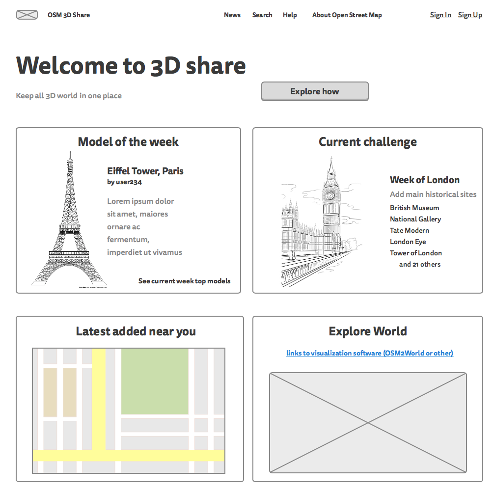
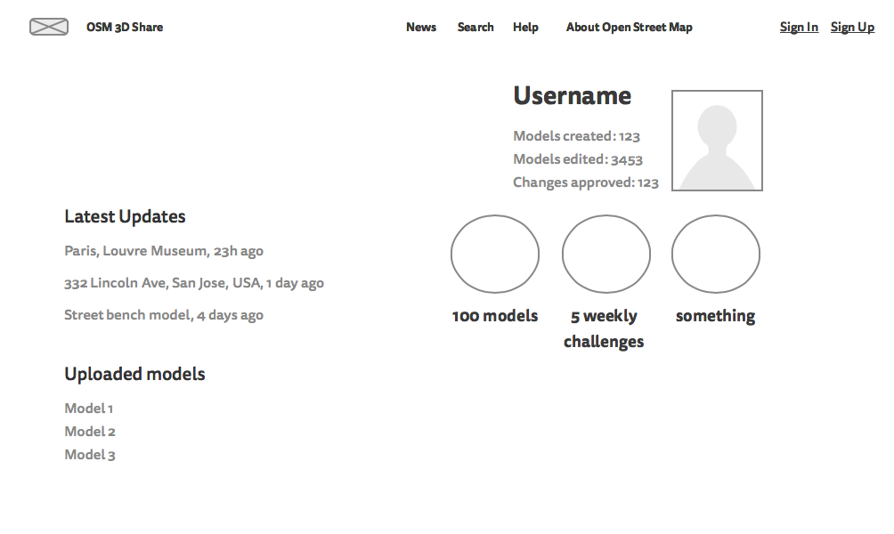
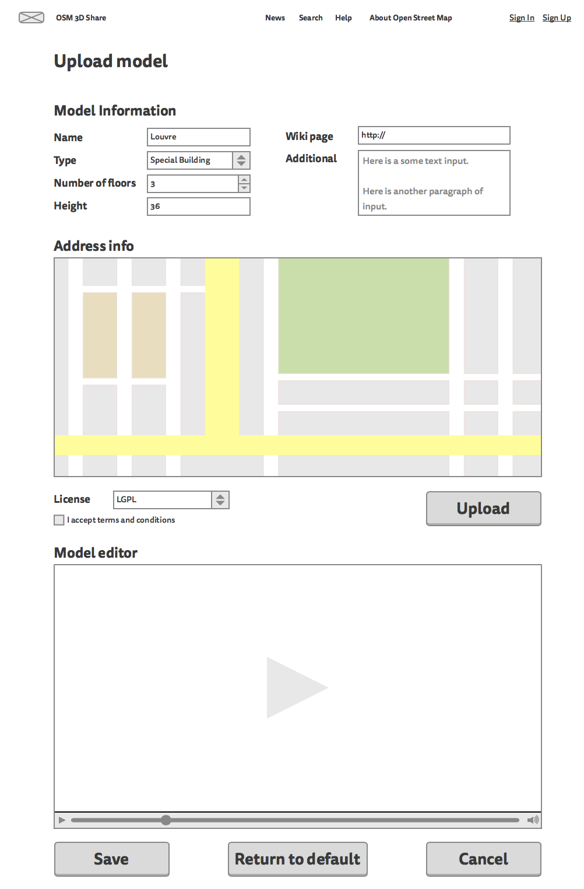
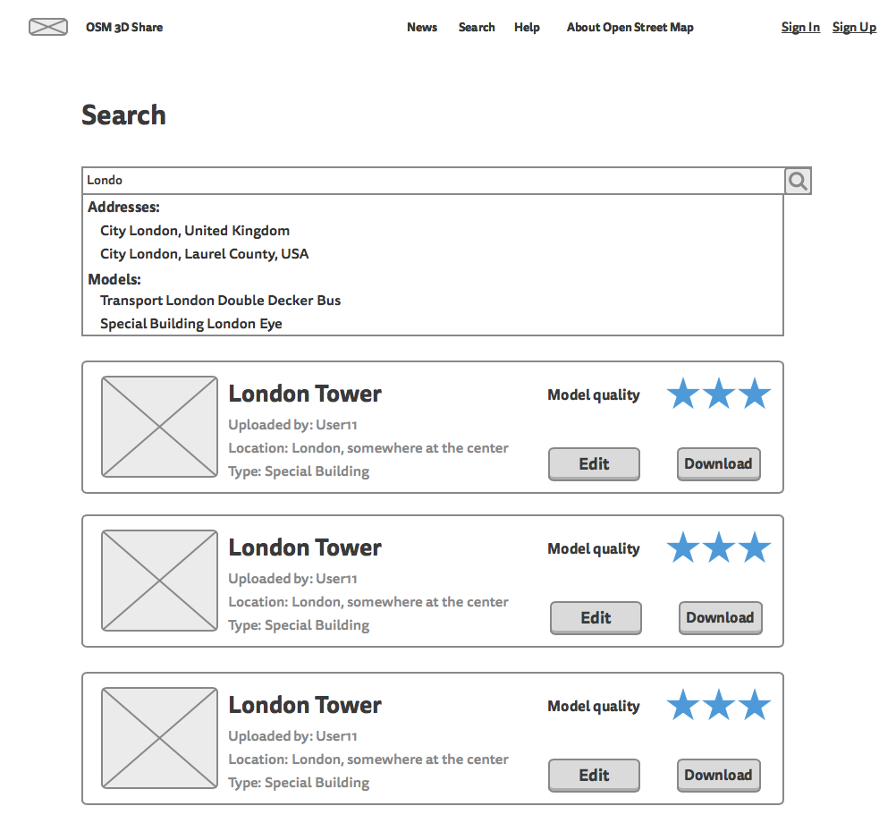

## User experience

There are four main pages: index, user page, model upload page, search page

### Index page
This is the first page for newcomers and everyone who enter.

It provide:
* Login form
* How to information
* News
* Information of challenges (best model of week and etc.)
* Header (more info and links to everything)
* Link to one or more 3D visualization tools (osm2world or related)

Use cases:
 1. Enter page, log in, participate in "fill-some-place-with-3d-models"
 2. Enter page, look through different places with visulization tool
 3. Enter page, look through information for beginers
 4. Enter page, go to their profile
 5. Enter page, go to search page

### User page
All information about user

Use cases:
 1. Enter page, go to recent edited models
 2. Enter page, look on achievements

### Model page
Main page. It's the tool to upload model into server

### Search page
Use cases:
 1. Find model by name
 2. Find model by address
 3. Find model by author
 4. Find model by type

### Edit page
Use cases:
 1. Edit metadata
 2. Edit model (simple 3D online will be available)

### Monthly dumps page
Use cases:
 1. Load all models in certain region
